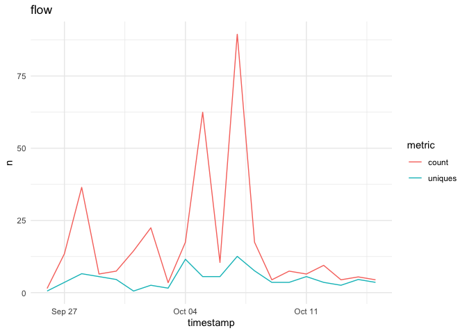
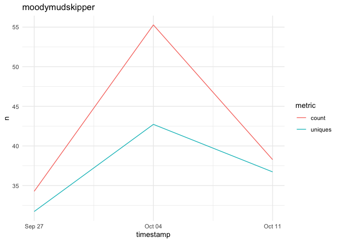

<!-- README.md is generated from README.Rmd. Please edit that file -->

# github.traffic

{github.traffic} lets you retrieve github traffic information + some
related info such as stars and watchers.

github only provides data for the last 14 days but this package helps
you build and update a local database wih this info. You can also
schedule he update to run at a chosen frequency (Windows only at the
moment)

## Installation

Install with:

``` r
remotes::install_github("moodymudskipper/github.traffic")
```

## Example

This is a basic example which shows you how to solve a common problem:

``` r
library(github.traffic)
```

Fetch last 14 days of data for a given repo (or a vecor of repos) :

``` r
fetch_github_traffic("moodymudskipper/flow")
```

Or all repos from a given owner (excluding forks and private repos),
this might take a bit of time if you have many repos. You can also
provide a character vector containing a mix of repos and owners.

``` r
fetch_github_traffic("moodymudskipper")
```

Create or update manually a local DB with this info

``` r
update_github_traffic_db("moodymudskipper") 
```

Or automate this process so it’s updated at the chosen frequency (daily
by default)

``` r
schedule_github_traffic_db_updates("moodymudskipper")
```

Then retrieve your data by running:

``` r
github_traffic_db()
#> $clones_per_day
#> # A tibble: 365 × 6
#>    owner           repo              fetch_time          timestamp  count uniques
#>    <chr>           <chr>             <dttm>              <date>     <int>   <int>
#>  1 moodymudskipper adventofcode2020  2021-10-15 21:43:34 NA            NA      NA
#>  2 moodymudskipper bigbrothr         2021-10-15 21:43:35 NA            NA      NA
#>  3 moodymudskipper bigbrothr.example 2021-10-15 21:43:37 NA            NA      NA
#>  4 moodymudskipper boom              2021-10-15 21:43:39 2021-10-03     1       1
#>  5 moodymudskipper boom              2021-10-15 21:43:39 2021-10-14     1       1
#>  6 moodymudskipper boomer            2021-10-15 21:43:40 2021-10-07     1       1
#>  7 moodymudskipper boomer            2021-10-15 21:43:40 2021-10-09     1       1
#>  8 moodymudskipper boomer            2021-10-15 21:43:40 2021-10-12     1       1
#>  9 moodymudskipper boomer            2021-10-15 21:43:40 2021-10-13     2       2
#> 10 moodymudskipper boomer            2021-10-15 21:43:40 2021-10-14     2       2
#> # … with 355 more rows
#> 
#> $clones_per_week
#> # A tibble: 277 × 6
#>    owner           repo              fetch_time          timestamp  count uniques
#>    <chr>           <chr>             <dttm>              <date>     <int>   <int>
#>  1 moodymudskipper adventofcode2020  2021-10-15 21:43:34 NA            NA      NA
#>  2 moodymudskipper bigbrothr         2021-10-15 21:43:35 NA            NA      NA
#>  3 moodymudskipper bigbrothr.example 2021-10-15 21:43:37 NA            NA      NA
#>  4 moodymudskipper boom              2021-10-15 21:43:39 2021-09-27     1       1
#>  5 moodymudskipper boom              2021-10-15 21:43:39 2021-10-11     1       1
#>  6 moodymudskipper boomer            2021-10-15 21:43:40 2021-10-04     2       2
#>  7 moodymudskipper boomer            2021-10-15 21:43:40 2021-10-11     6       5
#>  8 moodymudskipper burglr            2021-10-15 21:43:42 2021-10-11     1       1
#>  9 moodymudskipper check             2021-10-15 21:43:43 NA            NA      NA
#> 10 moodymudskipper cutr              2021-10-15 21:43:45 2021-09-27     1       1
#> # … with 267 more rows
#> 
#> $clones_per_14days
#> # A tibble: 216 × 5
#>    owner           repo              fetch_time          count uniques
#>    <chr>           <chr>             <dttm>              <int>   <int>
#>  1 moodymudskipper adventofcode2020  2021-10-15 21:43:34     0       0
#>  2 moodymudskipper bigbrothr         2021-10-15 21:43:35     0       0
#>  3 moodymudskipper bigbrothr.example 2021-10-15 21:43:37     0       0
#>  4 moodymudskipper boom              2021-10-15 21:43:39     2       2
#>  5 moodymudskipper boomer            2021-10-15 21:43:40     8       6
#>  6 moodymudskipper burglr            2021-10-15 21:43:42     1       1
#>  7 moodymudskipper check             2021-10-15 21:43:43     0       0
#>  8 moodymudskipper cutr              2021-10-15 21:43:45     1       1
#>  9 moodymudskipper datasearch        2021-10-15 21:43:46     1       1
#> 10 moodymudskipper debugonce         2021-10-15 21:43:48     1       1
#> # … with 206 more rows
#> 
#> $page_views_per_day
#> # A tibble: 667 × 6
#>    owner           repo              fetch_time          timestamp  count uniques
#>    <chr>           <chr>             <dttm>              <date>     <int>   <int>
#>  1 moodymudskipper adventofcode2020  2021-10-15 21:43:34 2021-10-02     1       1
#>  2 moodymudskipper bigbrothr         2021-10-15 21:43:35 NA            NA      NA
#>  3 moodymudskipper bigbrothr.example 2021-10-15 21:43:37 NA            NA      NA
#>  4 moodymudskipper boom              2021-10-15 21:43:39 2021-10-06     2       2
#>  5 moodymudskipper boom              2021-10-15 21:43:39 2021-10-08     1       1
#>  6 moodymudskipper boom              2021-10-15 21:43:39 2021-10-09     7       2
#>  7 moodymudskipper boom              2021-10-15 21:43:39 2021-10-11     2       1
#>  8 moodymudskipper boom              2021-10-15 21:43:39 2021-10-12     4       1
#>  9 moodymudskipper boom              2021-10-15 21:43:39 2021-10-13     2       1
#> 10 moodymudskipper boomer            2021-10-15 21:43:40 2021-10-02    18       4
#> # … with 657 more rows
#> 
#> $page_views_per_week
#> # A tibble: 330 × 6
#>    owner           repo              fetch_time          timestamp  count uniques
#>    <chr>           <chr>             <dttm>              <date>     <int>   <int>
#>  1 moodymudskipper adventofcode2020  2021-10-15 21:43:34 2021-09-27     1       1
#>  2 moodymudskipper bigbrothr         2021-10-15 21:43:35 NA            NA      NA
#>  3 moodymudskipper bigbrothr.example 2021-10-15 21:43:37 NA            NA      NA
#>  4 moodymudskipper boom              2021-10-15 21:43:39 2021-10-04    10       5
#>  5 moodymudskipper boom              2021-10-15 21:43:39 2021-10-11     8       2
#>  6 moodymudskipper boomer            2021-10-15 21:43:40 2021-09-27    19       5
#>  7 moodymudskipper boomer            2021-10-15 21:43:40 2021-10-04    20      11
#>  8 moodymudskipper boomer            2021-10-15 21:43:40 2021-10-11     9       8
#>  9 moodymudskipper burglr            2021-10-15 21:43:42 2021-10-04     1       1
#> 10 moodymudskipper burglr            2021-10-15 21:43:42 2021-10-11     8       4
#> # … with 320 more rows
#> 
#> $page_views_per_14days
#> # A tibble: 181 × 5
#>    owner           repo       fetch_time          count uniques
#>    <chr>           <chr>      <dttm>              <int>   <int>
#>  1 moodymudskipper boom       2021-10-15 21:43:39     1       1
#>  2 moodymudskipper boom       2021-10-15 21:43:39     1       1
#>  3 moodymudskipper boomer     2021-10-15 21:43:40     2       2
#>  4 moodymudskipper boomer     2021-10-15 21:43:40     6       5
#>  5 moodymudskipper burglr     2021-10-15 21:43:42     1       1
#>  6 moodymudskipper cutr       2021-10-15 21:43:45     1       1
#>  7 moodymudskipper datasearch 2021-10-15 21:43:46     1       1
#>  8 moodymudskipper debugonce  2021-10-15 21:43:48     1       1
#>  9 moodymudskipper dotdot     2021-10-15 21:43:49     1       1
#> 10 moodymudskipper doubt      2021-10-15 21:43:51     2       2
#> # … with 171 more rows
#> 
#> $popular_paths
#> # A tibble: 446 × 7
#>    owner           repo             fetch_time          path  title count uniques
#>    <chr>           <chr>            <dttm>              <chr> <chr> <int>   <int>
#>  1 moodymudskipper adventofcode2020 2021-10-15 21:43:34 /moo… mood…     1       1
#>  2 moodymudskipper boom             2021-10-15 21:43:39 /moo… mood…     8       7
#>  3 moodymudskipper boom             2021-10-15 21:43:39 /moo… Traf…     3       1
#>  4 moodymudskipper boom             2021-10-15 21:43:39 /moo… impl…     2       1
#>  5 moodymudskipper boom             2021-10-15 21:43:39 /moo… boom…     1       1
#>  6 moodymudskipper boom             2021-10-15 21:43:39 /moo… boom…     1       1
#>  7 moodymudskipper boom             2021-10-15 21:43:39 /moo… File…     1       1
#>  8 moodymudskipper boom             2021-10-15 21:43:39 /moo… Puls…     1       1
#>  9 moodymudskipper boomer           2021-10-15 21:43:40 /moo… mood…    34      21
#> 10 moodymudskipper boomer           2021-10-15 21:43:40 /moo… Issu…     5       1
#> # … with 436 more rows
#> 
#> $popular_referrers
#> # A tibble: 251 × 6
#>    owner           repo             fetch_time          referrer   count uniques
#>    <chr>           <chr>            <dttm>              <chr>      <int>   <int>
#>  1 moodymudskipper adventofcode2020 2021-10-15 21:43:34 github.com     1       1
#>  2 moodymudskipper boom             2021-10-15 21:43:39 community…     3       3
#>  3 moodymudskipper boom             2021-10-15 21:43:39 github.com     2       2
#>  4 moodymudskipper boomer           2021-10-15 21:43:40 github.com    15       8
#>  5 moodymudskipper boomer           2021-10-15 21:43:40 roamresea…     4       1
#>  6 moodymudskipper boomer           2021-10-15 21:43:40 Google         3       3
#>  7 moodymudskipper boomer           2021-10-15 21:43:40 cran.r-pr…     2       2
#>  8 moodymudskipper boomer           2021-10-15 21:43:40 t.co           1       1
#>  9 moodymudskipper boomer           2021-10-15 21:43:40 reddit.com     1       1
#> 10 moodymudskipper boomer           2021-10-15 21:43:40 keep.goog…     1       1
#> # … with 241 more rows
#> 
#> $repo_info
#> # A tibble: 216 × 13
#>    owner  repo  fetch_time          name  created_at updated_at pushed_at   size
#>    <chr>  <chr> <dttm>              <chr> <date>     <date>     <date>     <int>
#>  1 moody… adve… 2021-10-15 21:43:34 adve… 2020-12-10 2020-12-21 2020-12-21   122
#>  2 moody… bigb… 2021-10-15 21:43:35 bigb… 2020-11-25 2020-12-07 2020-11-25    81
#>  3 moody… bigb… 2021-10-15 21:43:37 bigb… 2020-11-25 2020-11-25 2020-11-25     2
#>  4 moody… boom  2021-10-15 21:43:39 boom  2021-02-02 2021-09-28 2021-02-05    33
#>  5 moody… boom… 2021-10-15 21:43:40 boom… 2021-02-05 2021-09-28 2021-09-05   780
#>  6 moody… burg… 2021-10-15 21:43:42 burg… 2021-04-29 2021-09-28 2021-05-01    41
#>  7 moody… check 2021-10-15 21:43:43 check 2020-09-29 2020-10-14 2020-09-29     7
#>  8 moody… cutr  2021-10-15 21:43:45 cutr  2018-09-16 2021-02-18 2019-08-22    72
#>  9 moody… data… 2021-10-15 21:43:46 data… 2020-11-05 2021-04-12 2020-11-05  4549
#> 10 moody… debu… 2021-10-15 21:43:48 debu… 2019-09-16 2019-09-17 2019-09-17     3
#> # … with 206 more rows, and 5 more variables: stargazers_count <int>,
#> #   forks_count <int>, open_issues_count <int>, subscribers_count <int>,
#> #   network_count <int>
```

`github_traffic_plot()` lets you visualize your visits and clones

``` r
# daily views of my {flow} package 
github_traffic_plot("flow", what = "views", freq = "day")
```



``` r
# weekly clones of all my repos
github_traffic_plot("moodymudskipper", what = "clones", freq = "week")
```


